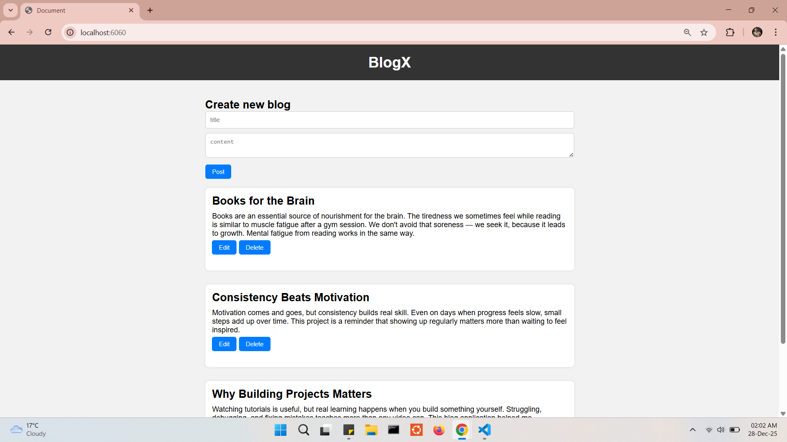

# Blog Web Application

A simple blog web application built with Node.js, Express, and EJS.
Users can create, view, edit, and delete blog posts.
Posts are stored in memory and do not persist between sessions.

## Features
- Create new blog posts
- View all posts on the home page
- Edit existing posts
- Delete posts
- Responsive and clean UI

## Tech Stack
- Node.js
- Express.js
- EJS
- HTML & CSS

---

## To run locally

1. Clone the repository
    ```bash
    git clone https://github.com/talukderemran61/portfolio.git
    ```
2. Install dependencies
    ```bash
    npm install express
    npm install ejs
    ```
3. Start the server
    ```bash
    node index.js
    ```
4. Open your browser and visit **`http://localhost:6060`**

---

## Screenshots

1. Home page


2. Added new blogs


3. Edit blog
