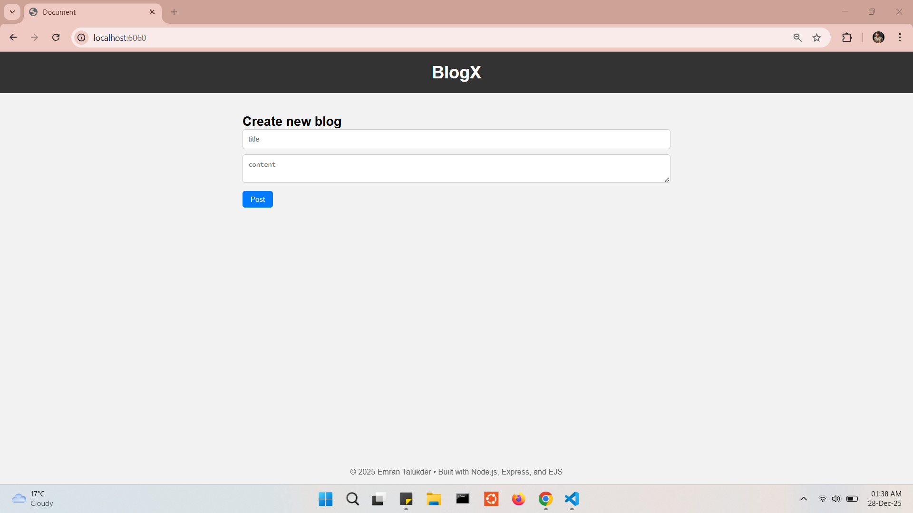

# Blog Web Application

A simple blog web application built with Node.js, Express, and EJS.
Users can create, view, edit, and delete blog posts.
Posts are stored in memory and do not persist between sessions.

## Features
- Create new blog posts
- View all posts on the home page
- Edit existing posts
- Delete posts
- Responsive and clean UI

## Tech Stack
- Node.js
- Express.js
- EJS
- HTML & CSS

---

## To run locally

1. **Download the ZIP** from the [GitHub release](https://github.com/talukderemran61/portfolio/releases/tag/v1.0).

2. **Install Node.js** if it’s not already installed.

2. **Unzip the project folder** and open a terminal inside the folder (PowerShell, CMD, Bash, etc.).

2. **Install dependencies:**
    ```bash
    npm install
    ```
3. **Start the server:**
    ```bash
    node index.js
    ```
4. **Open your browser** and visit: **`http://localhost:6060`**

---

## Screenshots

1. Home page


2. Added new blogs


3. Edit blog
